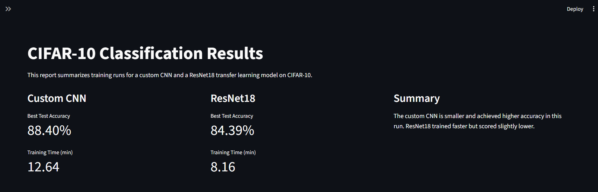
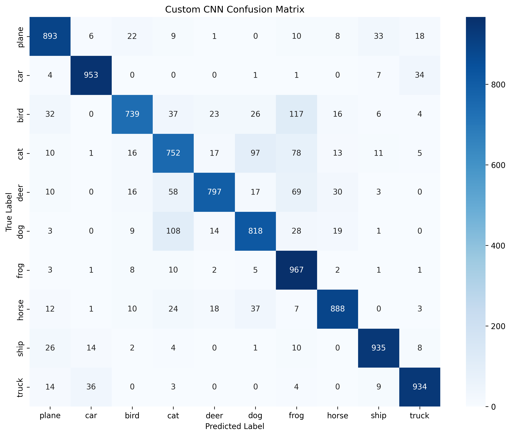
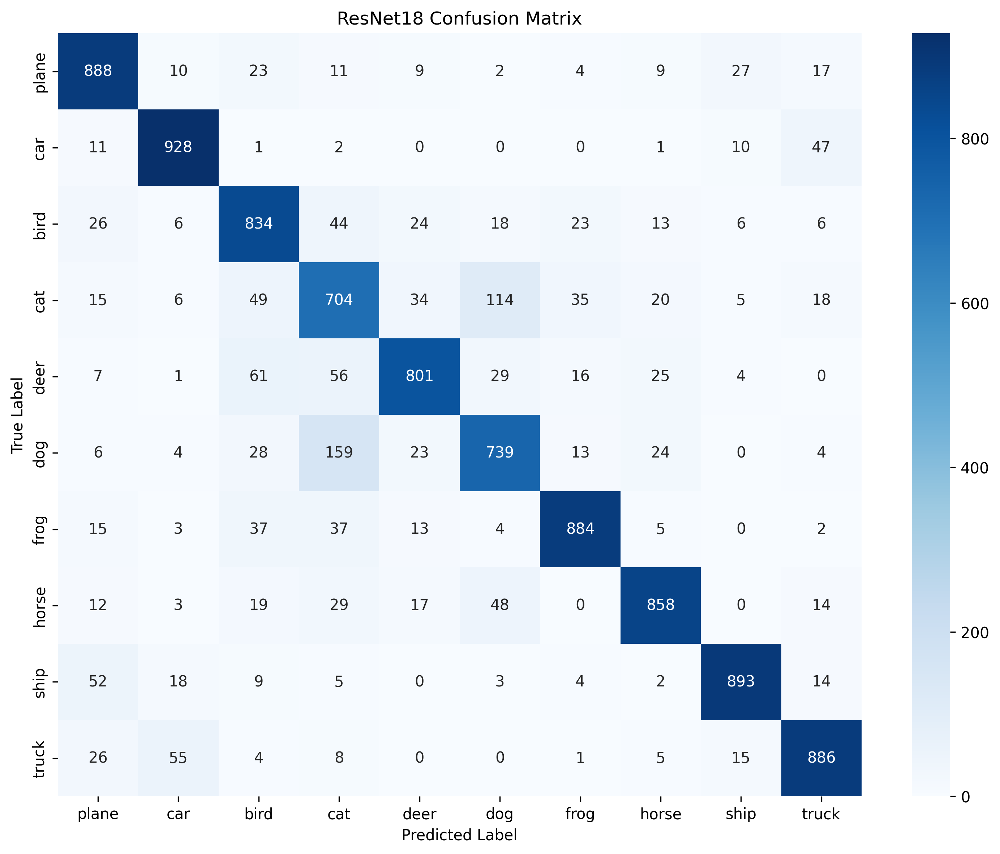
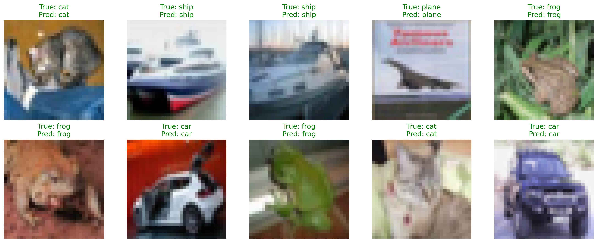

# CIFAR-10 CNN Classification

Train a custom CNN and a ResNet18 transfer model on CIFAR-10, compare results, and visualize performance.

## Project Structure

## Dataset

CIFAR-10: https://www.cs.toronto.edu/~kriz/cifar.html

- `cnn_classifier.py`: training + evaluation
- `app.py`: Streamlit results dashboard
- `results.json`: final experiment summary
- `assets/`: plots and visual outputs
- `models/`: saved model weights
- `data/`: CIFAR-10 dataset (auto-downloaded)

## Key Takeaways

- A custom-designed CNN (3.25M parameters) outperformed a pretrained ResNet18 (11.18M parameters) on CIFAR-10.
- Demonstrates that task-specific architecture design can outperform larger pretrained models.
- Highlights tradeoffs between model size, accuracy, and training time.

## Models

### Custom CNN (From Scratch)
- 3 convolutional blocks with BatchNorm, ReLU, and MaxPooling
- Dropout-based regularization in the classifier
- Designed specifically for 32×32 CIFAR-10 images
- ~3.25M parameters

### ResNet18 (Transfer Learning)
- Pretrained on ImageNet
- Final classification layer replaced for CIFAR-10
- Fine-tuned using Adam optimizer
- ~11.18M parameters

## Skills Demonstrated

- Convolutional Neural Network (CNN) design
- Transfer learning with pretrained models
- GPU-accelerated training using PyTorch
- Data augmentation and regularization techniques
- Model evaluation using confusion matrices and classification reports
- Experiment tracking and result visualization

## Setup

A virtual environment is recommended to keep dependencies isolated and avoid conflicts. You can also run this on your system Python if you prefer, but you may run into version clashes with other projects.

Create and activate a virtual environment, then install dependencies:

```powershell
.\venv\Scripts\python.exe -m pip install -r requirements.txt
```

If you have an NVIDIA GPU, install CUDA-enabled PyTorch:

```powershell
.\venv\Scripts\python.exe -m pip install torch torchvision torchaudio --index-url https://download.pytorch.org/whl/cu121
```

If you do NOT have an NVIDIA GPU (CPU-only):

```powershell
.\venv\Scripts\python.exe -m pip install torch torchvision torchaudio
```

### macOS

Create and activate a virtual environment:

```bash
python3 -m venv .venv
source .venv/bin/activate
```

Install dependencies:

```bash
python3 -m pip install -r requirements.txt
```

Install PyTorch (CPU/MPS build from PyPI):

```bash
python3 -m pip install torch torchvision torchaudio
```

## Train + Evaluate

```powershell
.\venv\Scripts\python.exe cnn_classifier.py
```

Outputs:
- Models saved in `models/`
- Plots saved in `assets/`
- Metrics printed to console

## Results Dashboard

```powershell
.\venv\Scripts\python.exe -m streamlit run app.py
```

Use the sidebar to save `results.json`.

## Latest Run (Best Scores)

- Custom CNN best accuracy: 86.76%
- ResNet18 best accuracy: 84.15%
- Custom CNN training time: 11.94 minutes
- ResNet18 training time: 7.66 minutes

## Screenshots

### Streamlit Dashboard



### Training Curves


### Custom CNN Confusion Matrix



### ResNet18 Confusion Matrix



### Sample Predictions



## Author

Farhan Labib
